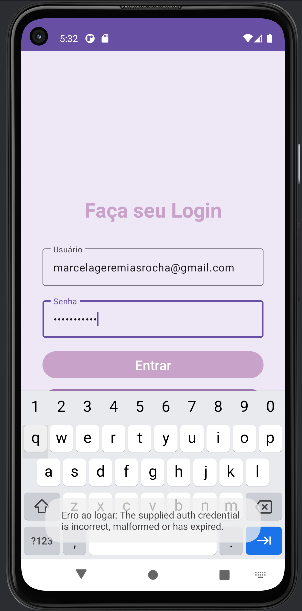
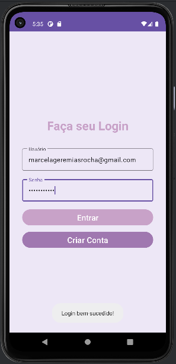

<h1 align="center">Aplicativo de Login com Firebase</h1>

## Project
The application allows the user to register with email and password, log in and upon successful authentication, it displays a "Login Successful" message.

## Layout
<div align="center">
  

</div>

## Technologies Used
- *Programming Language:* Kotlin
- *Development Environment:* Android Studio

## Code Author
```kotlin
fun main() {
    println("Code by Marcela Geremias!")
}